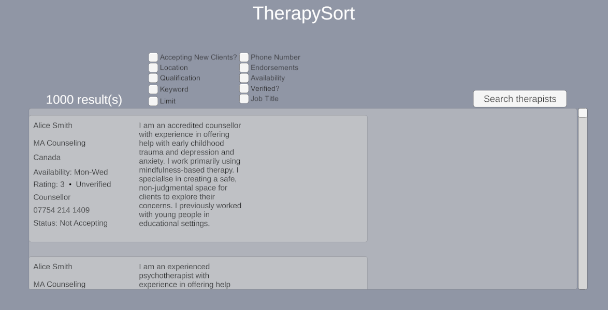
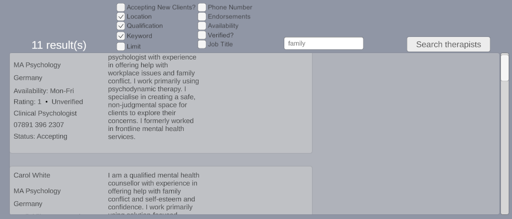

# TherapySort
TherapySort is a desktop application for searching and filtering therapist profiles across multiple criteria. It was originally developed for IB Computer Science HL coursework (internal assessment). It uses a Unity/C# frontend, Python Flash backend, and a SQLite database.

## Screenshots
### Main interface



## Features
- Filter therapist profiles by multiple criteria simultaneously
Search by location, qualifications, job title and keywords
- Filter by various parameters (eg. location, qualifications, job title, availability, etc...)
- Limit the number of returned results
- Dynamically generate therapist profile cards in the Unity interface
- Input validation and error handling
- Local Flask API connecting the Unity frontend to an SQLite database

## Project Structure
```
TherapySort/
├── data/
│   └── mental_health_dataset.csv
├── database/
│   ├── importCsvSqlite.py
│   └── init_db.py
├── docs/
│   └── therapySort coursework Documentation.png
├── release/
│   ├── README.md
│   └── TherapySort_v1.0.zip
├── src/
│   ├── backend/
│   │   └── backend.py
│   └── frontend/
│       └── scripts/
│           ├── FilterDropdownController.cs
│           ├── HTTP_Test.cs
│           └── TherapistFilter.cs
├── .gitignore
├── requirements.txt
├── LICENSE
└── README.md
```

## Running the application
A packaged Windows build is available under the `release/` directory. 

1. Download and extract `TherapySort_v1.0.zip`. 
2. See `release/README.md` for instructions on running the packaged application.

## Source Code
The repo includes the main source code used to develop TherapySort:

- `src/backend/` contains the Python Flask backend and filtering logic
- `src/frontend/scripts/` containts the C# scripts used by the Unity frontend
- `database/` contains the scripts used to initialise the SQLite database and import the dataset

The complete Unity project files are not included in this repo. The compiled Unity frontend, however, is under `release/`.

The Python dependencies used by the backend/database scripts are listed in `requirements.txt`.

## Dataset
The mock therapist dataset was adapted from a publicly available sample CSV dataset from [Datablist](https://www.datablist.com/learn/csv/download-sample-csv-files). The dataset was then modified to include extra fields. 

No real therapist or patient data is included.

## Documentation
The full project documentation is available in `docs/`.

The formatting is semi-long because of coursework requirements, but the PDF file covers:
- Requirements and success criteria
- UML class, use-case and sequence diagrams
- Entity relationship diagram and data dictionary
- Algorithm flowcharts
- Development process
- Testing and debugging
- Evaluation and proposed improvements

## Background info
TherapySort was originally developed as my IB Computer Science HL Internal Assessment.

The initial idea was to collect therapist listings from an existing website. However, after determining that scraping the  website would conflict with its terms of service, the project was redesigned to use mock data with the same required parameters.